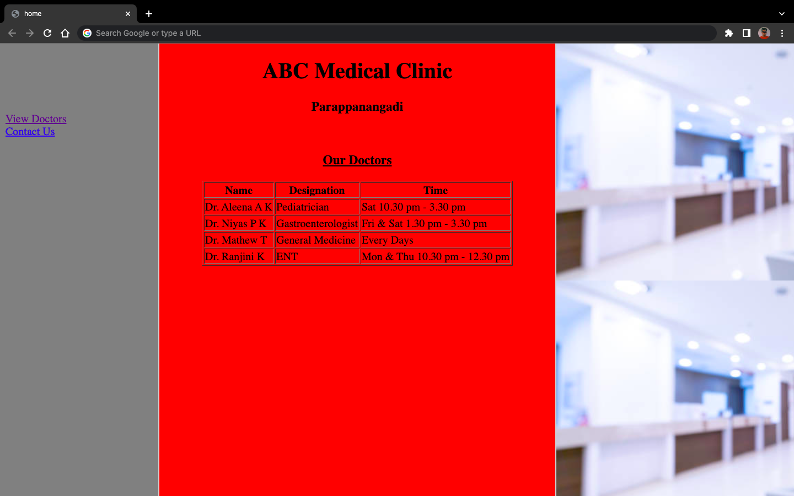

# 4. Partition of webpage using ＜frame＞ tag

### Aim

> Divide a webpage into 3 parts using frames and include a background image, table and hyperlink in the parts

### Code

```html
<!DOCTYPE HTML>
<html>

<head>
    <title>home</title>
</head>
<frameset cols="20%,50%,30%" frameborder="1" border="2px">
    <frame src="link.html" name="firstframe" noresize>
    <frame src="table.html" name="secondframe" noresize>
    <frame src="img.html" name="thirdframe">
    <noframes>
        <body>Your browser does not spport frames</body>
    </noframes>
</frameset>

</html>
```

link.html
```html
<!DOCTYPE HTML>
<html>

<head>
    <title>Link Page</title>
</head>

<body bgcolor="grey">
    <br>
    <br>
    <br>
    <br>
    <br>
    <a href="table.html" target="secondframe">
        View Doctors</a>
    <br>
    <a href="contact.html" target="secondframe">
        Contact Us</a>
</body>

</html>
```

table.html
```html
<!DOCTYPE HTML>
<html>

<head>
    <title>Table Part</title>
</head>

<body bgcolor="red">
    <center>
        <h1>ABC Medical Clinic</h1>
        <h3>Parappanangadi</h3>
        <br>
        <u>
            <h3>Our Doctors</h3>
        </u>
        <table border="1" cellspacing="O">
            <tr>
                <th>Name</th>
                <th>Designation</th>
                <th>Time</th>
            </tr>
            <tr>
                <td>Dr. Aleena A K</td>
                <td>Pediatrician</td>
                <td>Sat 10.30 pm - 3.30 pm</td>
            </tr>
            <tr>
                <td>Dr. Niyas P K</td>
                <td>Gastroenterologist</td>
                <td>Fri & Sat 1.30 pm - 3.30 pm</td>
            </tr>
            <tr>
                <td>Dr. Mathew T</td>
                <td>General Medicine</td>
                <td>Every Days</td>
            </tr>
            <tr>
                <td>Dr. Ranjini K</td>
                <td>ENT</td>
                <td>Mon & Thu 10.30 pm - 12.30 pm</td>
            </tr>
        </table>
    </center>
</body>

</html>
```

img.html
```html
<!DOCTYPE HTML>
<html>

<head>
    <title>book image</title>
</head>

<body background="images/mediclinic.jpg">
</body>

</html>
```

### Output

