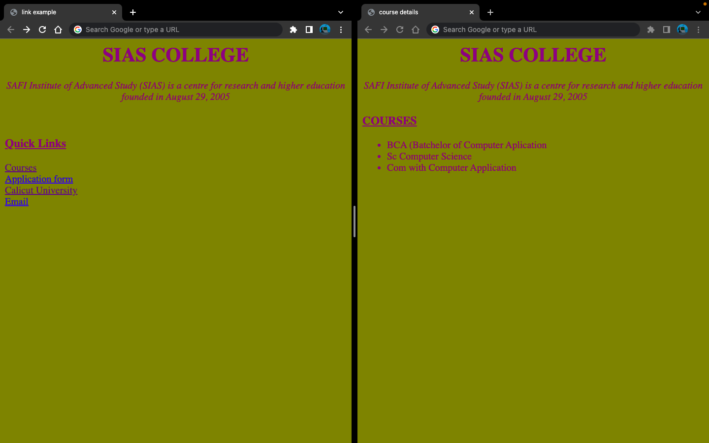

# 13. Create links to page, file and external link

### Aim

> Create web page to show page link,file link and external link

### Code

```html
<html>
<head>
    <title>link example</title>
</head>

<body bgcolor="olive">
    <font color="purple">
        <center>
            <h1> SIAS COLLEGE </h1>
            <i> SAFI Institute of Advanced Study (SIAS) is a centre for research and higher education founded in August 29, 2005 </i>
        </center>
        <br><br>
        <u>
            <h3>Quick Links</h3>
        </u>
    </font>
    <a href="13courses.html" target="top">Courses</a><br>
    <a href="files/applicationform.pdf" target="top" download>
        Application form</a><br>
    <a href="https://uoc.ac.in/" target="_top">
        Calicut University</a><br>
    <a href="mailto:lbspgdi@lbsmdc.ac.in">Email</a><br>
</body>

</html>
```

courses.html
```html
<html>

<head>
    <title>course details</title>
</head>

<body bgcolor="olive">
    <font color="purple">
        <center>
            <h1> SIAS COLLEGE
            </h1>
            <i> SAFI Institute of Advanced Study (SIAS) is a centre for research and higher
                education founded in August 29, 2005
            </i>
        </center>
        <u>
            <h3>COURSES</h3>
        </u>
        <ul>
            <li>BCA (Batchelor of Computer Application)</li>
            <li>BSc Computer Science</li>
            <li>BCom with Computer Application</li>
        </ul>
    </font>
</body>

</html>
```

### Output

