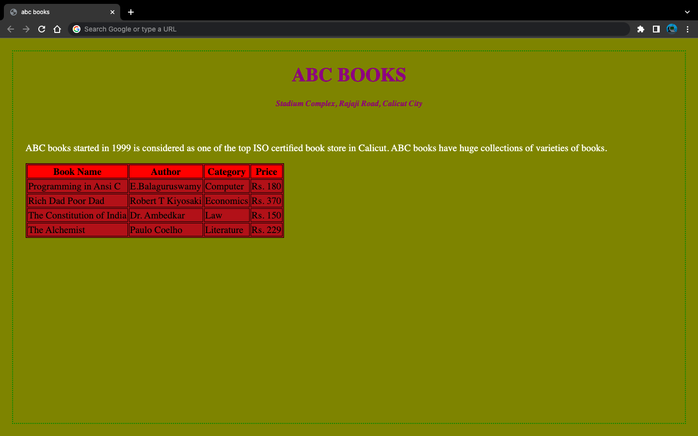

# 15. Internal style sheet implementation

### Aim

> Design a webpage using internal style sheet for setting styles to heading,body and table

### Code

```html
<html>
<head>
    <title>abc books</title>
    <style>
        body {
            margin: 20px;
            padding: 20px;
            border: 2px dotted green;
            background-color: olive;
            color: white;
        }

        table {
            background-color: brown;
            color: black;
            border: thin solid black
        }

        td {
            border: thin solid black;
        }

        th {
            border: thin solid black;
            background-color: red;
        }

        h1 {
            color: purple;
            text-align: center;
        }

        h5 {
            color: purple;
            text-align: center;
            font-style: italic
        }
    </style>
</head>

<body>
    <h1>ABC BOOKS</h1>
    <h5>Stadium Complex, Rajaji Road, Calicut City</h5>
    <br>
    <p>
        ABC books started in 1999 is considered as one
        of the top ISO certified book store in Calicut.
        ABC books have huge collections of varieties of books.</p>
    <table cellspacing="O">
        <tr>
            <th>Book Name</th>
            <th>Author</th>
            <th>Category</th>
            <th>Price</th>
        </tr>
        <tr>
            <td>Programming in Ansi C</td>
            <td>E.Balaguruswamy</td>
            <td>Computer</td>
            <td>Rs. 180</td>
        </tr>
        <tr>
            <td>Rich Dad Poor Dad</td>
            <td>Robert T Kiyosaki</td>
            <td>Economics</td>
            <td>Rs. 370</td>
        </tr>
        <tr>
            <td>The Constitution of India</td>
            <td>Dr. Ambedkar</td>
            <td>Law</td>
            <td>Rs. 150</td>
        <tr>
            <td>The Alchemist</td>
            <td>Paulo Coelho</td>
            <td>Literature</td>
            <td>Rs. 229</td>
        </tr>
    </table>
    </bodv>

</html>
```

### Output

